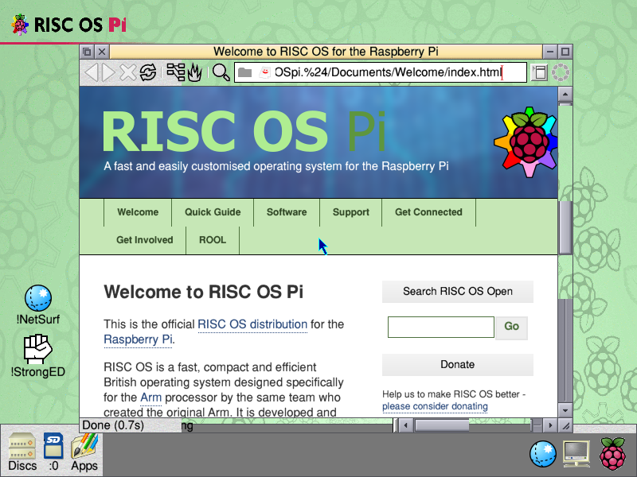
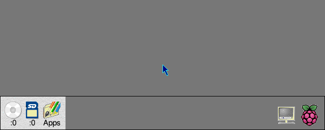
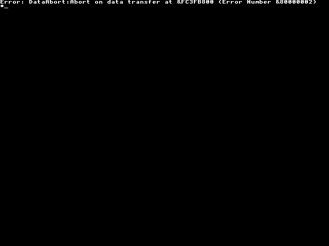

# RISC OS 5 on an emulated Raspberry Pi 4


> [!CAUTION]
> **RECENT EXPERIMENT.** Days old, everything in flux, and nothing here is
> finished. It boots the ROOL SD image to an 800×600 desktop with a keyboard,
> a mouse and a network. Speed is measured, not yet chased.
>
> The badge goes green when this is the fastest RISC OS A72 emulator there is,
> with an integrated debugging environment — and it works. Until then, treat
> everything below as a progress report rather than a product.
>
> It does now boot to a networked desktop on two hosts, with keyboard,
> mouse, sound, a filing system into directories on the host, and most of
> the desktop's drawing done by the host — further than that paragraph
> was ever written for.


A QEMU fork that boots **RISC OS 5.30 on an emulated Cortex-A72 in 32-bit
mode** — `-M raspi4b` with the CPU in AArch32 — from the RISC OS Open SD
image to the desktop, with a USB keyboard, a mouse, an Ethernet-over-USB
interface that takes a DHCP lease from QEMU's own network during the boot
sequence, **sound**, and **HostFS** — a filing system whose files live in a
directory on the host, readable and writable from the running desktop with
no reboot. Power-on to an idle, networked desktop is about 27 seconds on an
i7-12700, and 20.8 on an M4: it runs on **macOS as well as Windows**, with a
native front end on each.

Sound is the one with the least hardware behind it.
RISC OS reaches the speaker through a VCHIQ service and nothing else — no
PWM, no I2S, no VideoCore — so the fork answers the service, gathers the
samples out of the pagelist each bulk transfer describes, and hands them to
the host's own sound card. What that card takes is what the guest is told
has played, so its clock *is* the output device: delivery measures **0.998x
real time**. `riscos-pi4/SOUND.md` is the research and the three sprints.



Before the disc and the keyboard it looked like this, and before that like
this, which is where most of the work went:





Branch: `riscos-pi4`, on top of QEMU **v11.1.0**.

## Why

RISC OS 5's Raspberry Pi build targets a Cortex-A72 in AArch32. There was no
way to run it under emulation: stock QEMU boots the ROM into a hang inside the
HAL, and the ARMv4-class RiscPC emulators cannot execute ARMv8-A A32 code at
all. This fork closes that gap, so RISC OS work aimed at a Pi 4 can be done,
debugged and tested on a desktop.

## Status

Working: HAL and kernel bring-up, the MMU, secondary cores, I2C, the VCHIQ
connect handshake, a framebuffer allocated through the VideoCore property
channel; **SDFS** from a card image on EMMC2, and the `!Boot` sequence of
the ROOL image running off it; **USB** through the DWC2 controller —
keyboard and mouse, on the root port or behind a hub — which on a Pi 4
means the FIQ path RISC OS drives it from; **networking**, RISC OS's
`EtherUSB` binding a CDC-Ethernet `usb-net` on QEMU's user-mode network;
and **HostFS**, files in and out of a running guest through a doorbell
device.

The machine now has its own **window** on both hosts: `-display dx11`
(Sprints U0–U2) puts a Win32 window on the main thread with the guest
framebuffer decoded on the GPU each frame — raw bytes uploaded from mapped guest RAM, an
8bpp-palette/32bpp pixel shader, and a scale pass that stretches any mode
to the client area, because the window is the monitor. PrintScreen writes
the decoded surface to a PNG. The keyboard and mouse in that window reach
the guest: scan codes through the AT set 1 keymap, mouse deltas with the
cursor warped to centre while grabbed, grab released with Ctrl+Alt+G or by
losing focus. Window moves and scrolls redraw completely — the DMA engine
now performs the 2D, 128-bit-wide, negative-stride copies RISC OS's video
driver issues for them, where it previously refused the transfer and the
Wimp redrew only the exposed strips.

**Timers are exact.** RISC OS is interrupt-driven: the 100 Hz ticker waits
on a system-timer compare, the desktop's vertical sync on the SMI
interrupt the GPU firmware raises, and BCMVideo's half-frame update on the
ARM timer once it has seen a vsync. Main-loop timers lost one tick in nine
(88.7 Hz, worst gap 222 ms). One host thread — `system/hrtimer.c` — now
waits on a high-resolution waitable timer on Windows and fires under the
BQL; the system timer's compares, the vsync generator and the ARM timer's
half-frame pulse are deadlines on it, and a vsync generator pulses an SMI
latch and an ARM-timer latch (thin registers that record what the guest
writes). Measured over an idle desktop: **100.0 ticks a second, worst gap
11.6 ms**. The vsync rate is `-display dx11,vsync=N`, default 30; the
render loop sends nothing.

**macOS runs the same machine**, on Apple silicon, with `-display metal`:
`ui/metal.{h,c,m}`, the twin of the D3D11 front end, down to the same
eleven-call boundary — a Cocoa window on the main thread, the guest
framebuffer decoded by an MSL shader specialised per pixel format, the
same three scalers and the same optional scanlines, ⌘S or F13 for a PNG.
Keyboard, pointer, buttons and drags all reach the guest.
The emulation itself needed no changes at all. Power-on to a settled,
networked desktop is **20.8 seconds** on an M4 against about 27 on the
i7-12700, and the centisecond ticker measures 100.0 a second with a worst
gap of 12.5 ms on the POSIX branch of `system/hrtimer.c` against 11.6 ms
from the Windows waitable timer — so that thread's precision did not have
to be reproduced. `riscos-pi4/MACOS.md` is that record, with the rest of
the numbers.

The screen is 800×600 by default because the firmware channel answers
`GET_EDID_BLOCK` with a synthetic monitor of that size and the image's own
CMOS says MonitorType EDID; RISC OS's ScreenModes does the rest. That EDID
is now a table — 640×480 through 1920×1200, the 16:10 sizes Macs actually
have included — and `-global bcm2835-property.mode=1920x1200` picks the
preferred timing; the range-limits descriptor capping the pixel clock at
50 MHz was the gate that took finding. A mid-session mode change through
the Display Manager rebuilds the front end's pipeline without a flicker
(verified 32bpp → 8bpp → 32bpp in one session, and at 1920×1080 on dx11).

**Sound**, through the VCHIQ audio service RISC OS actually uses:
`BCMSound` opens `'AUDS'` and ships PCM over the channel this fork
already owned, so there is no audio hardware modelled at all. The samples
are gathered out of the pagelist each bulk transfer describes and handed
to QEMU's audio backend — `coreaudio` on macOS, `dsound` on Windows — and
what the host's sound card takes is what the guest is told has played, so
its clock is the real output device and delivery measures 0.998x real
time. `riscos-pi4/SOUND.md` is the research and the three sprints.

**The pointer is a hardware sprite again.** On a real Pi the pointer is a
dispmanx overlay the GPU composites; this fork refused that service, so
the kernel painted a software pointer into the framebuffer — a save-under
and restore bracketing every plot while the pointer was on screen. The
VCHIQ peer now answers `'DISP'` with the subset the pointer uses: the ROM
converts its own 2 bpp shape (the anti-fringe fill included) and
bulk-writes a 32×32 ARGB image, moves arrive as element transactions
committed at `UpdateSubmit`, and the window composites the sprite over
the frame — sharp at any scale, never in guest RAM, the save-under tax
gone from every redraw. `riscos-pi4/GPUDESIGN.md` is the design and the
build record. The Windows twin has landed: the D3D11 front end composites
the same sprite through the same peer.

**Host files, both ways.** `HostFS:` is a real filing system whose root is
a directory on the host: a file dropped into the share is on the desktop
without a reboot, a file saved from RISC OS appears on the host with honest
metadata (type from the `,xxx` suffix, date from the mtime — the DOS-disc
convention), and a filer module puts the share on the icon bar as a disc.
Underneath is a doorbell device at an address the HAL does not name: the
guest writes a request block into its own RAM and pokes a register, and
QEMU runs the command synchronously under the BQL — no interrupts, no
ring, nothing to migrate beyond four registers — with every host path
clamped to the configured root. `riscos-pi4/FSDESIGN.md` is the design;
the SMB route it replaced is dead for a structural reason (the ROM's
LanManFS speaks SMB1 only, this Windows speaks SMB2 only), recorded with
the evidence in `SPRINTS.md`.

**The desktop's drawing is moving to the host.** A `riscos-blitter` device
fills rectangles, copies and plots sprites straight into guest RAM at
memory speed; `GVFill`, a soft-loaded module, claims the fill and sprite
vectors and hands it the work, passing through everything it does not
understand. On a 1920×1200 desktop with NetSurf and a filer window,
**98.2% of sprite pixels** are plotted by the host, the plot itself runs
at **6.1x** SpriteExtend's speed — 490us a plot against 80us, 62us of
which is the host blit — and a pixel compare against the same scene
without the module reads **0 differing pixels of 2,304,000**, re-run
after every change. Masked sprites drew the desktop wrong and were backed
out whole; what is still passed up is one plot-action bit whose meaning
only the ROM's assembly veneer can settle. `riscos-pi4/blitter/README.md`
is the build and the numbers, and `riscos-pi4/BANKS.md` is the next step
on top of it: double-buffered desktop drawing through the second screen
bank the kernel already allocates, so a mistimed swap shows a complete
older frame instead of a torn one.

Neither front end reads the screen on its own clock any more. dx11 steps
its read to the guest's vsync phase and fingerprints every row either side
of the copy, declining to show a frame it caught mid-repaint — a window
move on an emulated machine spans many host frames, and the splice was
the flash of a window in two places at once. The Metal front end copies
when the blitter's flag says the guest has stopped drawing, which cut its
framebuffer copies to **25% of frames** over 4500 measured: the desktop
is idle almost all of the time, because the Wimp only draws when a task
asks it to.

Not working yet: `SET_CLOCK_RATE` is still NYI (the property channel now
logs which clock it asks for). The boot spends about five seconds reading
the card at a millisecond per stall for reasons that are measured but not
yet understood (DESIGN.md §12). GVFill still passes up masked sprites and
the calls carrying an unexplained plot-action bit — 56 of the 59 it
declines. The Apple Events surface stops at E3: breakpoints, single step
and the signing of E4–E6 are not built. The Metal settle-copy's saving is
held to 75% — copies down to a quarter of frames — because text and lines
are plotted straight to memory and never raise the blitter's flag.

## What it changes

Nine of these are plain QEMU bugs with nothing RISC OS-specific about
them, and are candidates for upstream:

| Commit | Who else it affects |
| --- | --- |
| `hw/arm/raspi`: use the AArch32 secondary boot stub for 32-bit guests | **Any** 32-bit guest on `raspi3b`/`raspi4b` — the stub is chosen by SoC generation rather than CPU state, so secondaries execute an AArch64 stub as ARM |
| `hw/i2c/bcm2835_i2c`: allow byte access | Any guest that uses `STRB` on the FIFO, which is a byte port |
| `hw/i2c/bcm2835_i2c`: only start a transfer on ST, and buffer the TX FIFO | Any guest following the documented sequence — set A, set DLEN, fill FIFO, *then* set ST |
| `hw/arm/bcm2838`: connect the system timer to the GIC | Any guest using the system timer through the GIC on `raspi4b`; its compare outputs only ever reached the legacy interrupt controller |
| `hw/arm/bcm2838`: put the SD card on EMMC2 | Any `raspi4b` guest that uses the card — the BCM2711 keeps it on EMMC2 and Linux's device tree says so too; QEMU had it on the GPIO block's legacy mux |
| `hw/intc/arm_gic`: legacy nFIQ inputs, through the GICv2 interrupt-signal bypass | Any SoC that wires an older interrupt controller into a GIC-400's legacy inputs; the BCM2711 does, and RISC OS relies on it |
| `hw/dma/bcm2835`: 2D transfers of any width, rows moved whole | Any guest using the DMA engine's 2D mode — width bits and alignment are bus-transfer choices, not reasons to fail a transfer, and a failed copy read as "complete" to drivers that never check |
| `hw/usb/hcd-dwc2`: keep `GINTSTS.HCHINT` in step with `HAINTMSK`, and the IRQ level per device | Any guest whose driver defers a channel interrupt by masking it — the FIQ state machine RISC OS inherited from the Pi Linux driver does |
| `hw/usb/dev-network`: `rndis=off`, a CDC-only `usb-net` | Any guest whose USB stack announces a device in its first configuration only |

The rest are missing devices, unanswered firmware calls, and fork
infrastructure:

- `system/hrtimer.c`: the **high-resolution timer thread** — one host
  thread, a high-res waitable timer on Windows, callbacks fired under the
  BQL; everything RISC OS waits on in a timer is a deadline on it
- `hw/misc`: the **vsync generator** that pulses the SMI vsync latch and
  the ARM timer's half-frame input, and the thin register files behind
  both latches
- `hw/misc`: BCM2835 mailbox **channel 0** (power management) — defined since
  the mailbox was first modelled, never given a peer
- `hw/misc`: a **VCHIQ peer** for mailbox channel 3, plus the VC→ARM and
  ARM→VC doorbells — answering the `'AUDS'` audio and `'DISP'` pointer
  services, refusing the rest
- `hw/misc/vmchannel.c`: the **doorbell device behind `HostFS:`** — a
  request block written into guest RAM, run synchronously inside the MMIO
  write under the BQL; no interrupts, no ring, nothing to migrate beyond
  four registers, and every host path clamped to the configured root
- `hw/misc/riscos_blitter.c`: the **blitter** — fill, copy and sprite
  plot into guest RAM at host memory speed, reached through a doorbell at
  `0xFD404000` whose page the guest maps with `OS_Memory 13`
- `util/oslib-win32.c`, `util/oslib-posix.c`: **hybrid-core placement**
  for vCPU threads — fast and slow cores are detected, but pinning
  measured 13% slower on an i7-12700 and stays off (`QEMU_VCPU_PIN`
  forces it); what ships is only the opt-out from the efficiency QoS
  class, so a busy vCPU is never parked on the slow cores — on macOS the
  same nothing-overridden choice, via the QoS ladder (`QEMU_VCPU_ECORES`
  opts out of all of it)
- `hw/misc/bcm2835_property`: the touch and GPIO virtual buffer tags, and the
  GPIO state tags; and **`GET_EDID_BLOCK`**, answered with an EDID block for
  an 800×600 monitor, which is what turns the 640×256 fallback into a desktop
- `hw/arm/bcm2838`: an unimplemented-device stub over the PCIe root complex,
  so probing it reads as "link down" instead of taking an external abort
- `hw/arm/bcm2838`: the same over the **GENET Ethernet MAC** register block
  at `0xfd580000` — no MAC is modelled, but a driver that probes it must
  read "no silicon", not abort
- `ui/metal.c`, `ui/metal.m`: the **Metal windowed display** (`-display
  metal`), macOS-only — a Cocoa window and a `CAMetalLayer` on the main
  thread, QEMU's loop on a worker, joined at the same boundary `ui/dx11.h`
  declares; MSL compiled at start-up and specialised with function
  constants, where the Windows side compiles HLSL with `D3DCompile`
- `ui/metal_script.m`, `riscos-pi4/app/`: the **Apple Events scripting
  surface** (sprints E0–E3 of `SCRIPTING.md`) — `ping`, `describe` and
  the command table, lifecycle, snapshots, both screenshots, paced
  typing, and the debugging set `hmp`/`mem`/`regs`/`pc`/`disa`/`capture`,
  answered in a JSON envelope from inside the front end
- `ui/dx11.c`, `ui/dx11.cpp`: the **D3D 11 windowed display** (`-display
  dx11`), Windows-only — a Win32 window and flip-model swap chain on the
  main thread, QEMU's loop on a worker, joined at an `extern "C"` boundary
  because QEMU's headers are not C++-parseable
- `hw/intc/bcm2838_ic`: the **BCM2711 legacy interrupt controller** — the
  per-core IRQ and FIQ banks at ARMC+0x200 from the datasheet — and the DWC2
  line split so that USB reaches it as well as the GIC. RISC OS runs its USB
  host controller from the FIQ handler and enables that FIQ here; QEMU had
  the address shadowed twice over
- `scripts/symlink-install-tree`: survive a build host without symlink
  permission — a local Windows workaround, **not** for upstream

The guest side of the newest work is RISC OS modules kept in
`riscos-pi4/`: `hostfs/` builds `HostFS,ffa` and its filer, `blitter/`
builds `GVFill,ffa` — soft-loaded, `*RMKill`-able, no ROM splice.

## The design principle

> Rather than emulating VideoCore, emulate the functions needed by RISC OS. Be
> as soft and fake as possible and emulate hardware only if we are desperate.
> We probably do need interrupts though — the whole system is running off
> timers.

Real interrupts where the OS genuinely depends on them; functional shims
everywhere else. The VCHIQ peer is the clearest example: about 250 lines that
complete the connect handshake and then *refuse* every service the guest opens.
It models no hardware. It answers questions.

That refusal is deliberate rather than lazy — accepting the sound service walks
the guest into another blocking wait, while declining leaves the GPU mode path
switched off so display setup falls back to the property channel, which QEMU
already models completely.

## Building on macOS

Apple clang and Homebrew; `riscos-pi4/MACOS.md` has the whole of it,
including what `-display metal` takes and what is not done yet.

```bash
brew install meson ninja pkgconf glib pixman capstone libslirp libpng

mkdir build-macos && cd build-macos
../configure --target-list=aarch64-softmmu --enable-plugins --disable-werror \
    --disable-gtk --disable-sdl --disable-vnc --disable-docs \
    --disable-guest-agent --enable-capstone --disable-spice --enable-slirp \
    --enable-cocoa \
    --cc=/usr/bin/clang --cxx=/usr/bin/clang++ --objcc=/usr/bin/clang
ninja
```

Pass Apple's clang explicitly: a Homebrew clang on `PATH` is picked up
otherwise, and the Objective-C wants the system compiler and the system
SDK to agree.

## Building on Windows

There is no supported non-MSYS2 route. In an MSYS2 **MINGW64** shell:

```bash
pacman -S --needed base-devel git \
  mingw-w64-x86_64-{gcc,glib2,pixman,zlib,pkgconf,ninja,meson,python,capstone,libpng,libslirp}

mkdir build && cd build
../configure --target-list=aarch64-softmmu --enable-plugins --disable-werror \
    --disable-gtk --disable-sdl --disable-vnc --disable-docs \
    --disable-guest-agent --enable-capstone --disable-spice --enable-slirp
ninja
```

Two things that will bite you:

- **Do not drop capstone.** Without it the monitor's `x/i` reports "Asm output
  not supported on this arch", and disassembly is most of what you need here.
  libpng is needed for `screendump` in PNG rather than PPM.
- The built binary needs `<msys64>/mingw64/bin` on `PATH` for its glib and
  pixman DLLs. Without it Windows terminates it silently — no error, no output.

## Running

The ROM is **not** included: it is RISC OS Open's, and free to download is not
the same as free to redistribute. Get the "RPi ROM stable" zip from
<https://www.riscosopen.org/content/downloads/raspberry-pi> and take
`RISCOS.IMG` out of it.

The SD image is theirs too: the "RISC OS Pi" zip from the same page unpacks
to a raw card image. QEMU wants a card of 2 GiB or under to be an exact power
of two, so pad it (`truncate -s 2G card.img`); it also wants it writable, and
`snapshot=on` keeps the file pristine across runs.

The image's boot partition also carries a `CMOS` file: RISC OS's own
settings for the machine, MonitorType EDID among them. Copy it out (any FAT
tool; `riscos-pi4/tools` has a reader) and build the blob from it:

```bash
python riscos-pi4/tools/mkcmos.py --riscos-src <path>/BCM2835/RiscOS \
    --rom RISCOS.IMG --base CMOS --unplug 106 -o cmos.bin

qemu-system-aarch64 -M raspi4b -cpu cortex-a72,aarch64=off \
    -kernel RISCOS.IMG \
    -device loader,file=cmos.bin,addr=0x510000,force-raw=on \
    -drive file=card.img,if=sd,format=raw,snapshot=on \
    -netdev user,id=n0 \
    -device usb-hub,bus=usb-bus.0,port=1 \
    -device usb-kbd,bus=usb-bus.0,port=1.1 \
    -device usb-tablet,bus=usb-bus.0,port=1.2 \
    -device usb-net,netdev=n0,rndis=off,bus=usb-bus.0,port=1.3 \
    -global bcm2838-peripherals.vmchannel-root=$HOME/riscos-share \
    -display dx11 \
    -qmp tcp:127.0.0.1:4455,server,nowait
```

Things worth knowing about that line:

- `--base CMOS` starts from the distribution's settings; without it, use
  `--filesystem 192` to boot from SDFS and expect a 640×256 desktop, since
  the kernel's defaults have no monitor type. Leave the `-drive` out and it
  boots to the desktop from ROM alone, with nothing behind the SD icon.
- The DWC2 controller has one root port, hence the hub. A lone `usb-kbd` can
  sit on `port=1` directly. Name the ports: a bare `-device usb-kbd` lands
  behind an automatic hub, which works but hides what you are testing.
- The pointer is a `usb-tablet`, not a `usb-mouse`: RISC OS's USB mouse
  driver claims absolute HID devices too, and an absolute pointer is what
  lets the dx11 window place the guest arrow exactly under the host
  cursor. While the pointer is grabbed the window integrates the host
  deltas into that same absolute position, so it still moves like a
  relative mouse but cannot drift.
- The ROOL image's `Choices:Internet.Startup` runs `DHCPExecute -w ej0` and
  waits for that Ethernet-over-USB interface until it appears or Escape is
  pressed — stock RISC OS behaviour on a Pi with no network. `usb-net` with
  `rndis=off` *is* `ej0`: RISC OS's `EtherUSB` binds its CDC configuration,
  and slirp's DHCP server answers during the boot. Without it, press Escape
  and the desktop arrives with the usual "Machine startup has not completed
  successfully" box.
- `-global bcm2838-peripherals.vmchannel-root=<dir>` turns that host
  directory into `HostFS:` inside the guest (`FSDESIGN.md`); left out, the
  doorbell stays but file commands report off. `GVFill` rides the same
  channel once loaded: `*RMLoad hostfs:$.GVFill,ffa`. A wider desktop is
  one property — `-global bcm2835-property.mode=1920x1200`. On the Mac,
  `tools/run-macos.sh` is this line with those options wrapped up
  (`RISCOS_HOSTFS`, `MODE`), passing extra arguments through.

**Both parts of the first pair are needed to reach the desktop.** A Raspberry Pi has no CMOS
chip, so the HAL takes its settings from a blob the firmware leaves in memory
after the OS image — and under emulation QEMU *is* the firmware. Without one
the HAL blanks the settings and the machine boots unconfigured; without
`--unplug 106` the EtherGENET driver dereferences a null pointer and RISC OS
prints a data abort on its own console. `mkcmos.py` derives both the blob and
the address to load it at from RISC OS's own headers and ROM image; it also
takes `--unplug EtherGENET` by title instead of number (it walks the ROM's
module chain exactly as `Kernel/s/ModHand` does), and `--symbols
tools/cmos-symbols-530.json` in place of `--riscos-src`, so the blob builds
from the image's own `CMOS` file with no source checkout:

```bash
python riscos-pi4/tools/mkcmos.py --rom RISCOS.IMG \
    --base CMOS --unplug EtherGENET \
    --symbols riscos-pi4/tools/cmos-symbols-530.json -o cmos.bin
```

If you cannot lay hands on the RISC OS sources that `mkcmos.py` needs,
`riscos-pi4/tools/patch-rom-nogenet.py` achieves the same by patching the
ROM image instead of the CMOS: EtherGENET's init becomes a no-op and its
service/SWI entries are removed. Boot `-kernel RISCOS-nogenet.IMG` and the
rest of this page works unchanged. The failure without either is loud and
specific — `Error: DataAbort:Abort on data transfer at &FC3FB800` — which
is EtherGENET calling a method on a device it never attached, because the
GENET MAC is not modelled: the HAL hands the driver a GENET device at
`0xfd580000` from a fixed table (RISC OS reads no device tree), the driver
finds no controller there and later dereferences the pointer it never
filled in. That register block is covered by an unimplemented-device stub
so the probe reads zero instead of taking an external abort; it does not
save the boot on its own, hence the unplug bit.

`-display dx11` is the fork's own Windows display (Sprints U0–U1): a Win32
window on the main thread with a D3D11 flip-model swap chain, QEMU's main
loop running on a worker thread. The guest framebuffer is decoded on the
GPU each frame — raw bytes uploaded lock-free from mapped guest RAM, a
per-format pixel shader (8 bpp palette and 32 bpp are the two RISC OS
ever asks for; 16/24 and sub-byte ride along), and a scale pass that
stretches any mode to the whole client area, because the window is the
monitor. PrintScreen writes the decoded surface to `dx11-screenshot-N.png`;
closing the window shuts the emulator down cleanly. Failures land in
`dx11-debug.txt` next to the process; `DX11_DEBUG=1` in the environment
asks for the D3D11 debug layer.

`-cpu cortex-a72,aarch64=off` is the load-bearing part. `-M raspi4b` hard-codes
its CPU, so it is widely assumed `-cpu` does nothing there — but the *property*
still lands, and without it the ROM's ARM32 vector table is decoded as AArch64
and executed as garbage.

`riscos-pi4/tools/` has a boot probe that samples the PC and takes a
screendump over QMP, two bare-metal instruction-rate benchmarks, and a
self-contained regression test for the mailbox channel-0 fix that does not need
RISC OS at all. See `tools/README.md`.

`riscos-pi4/DESIGN.md` is the full record: what was measured, what was tried,
which hypotheses were wrong, and why each fix is shaped the way it is.
`riscos-pi4/MACOS.md` is the macOS port; `riscos-pi4/SOUND.md` is the
research and the three sprints behind the sound — which needed no audio
hardware at all, because RISC OS reaches the speaker through the VCHIQ
service this fork already owns. `riscos-pi4/FSDESIGN.md` is `HostFS:` and
the vmchannel device; `riscos-pi4/blitter/README.md` is GVFill and its
numbers; `riscos-pi4/BANKS.md` is the double-buffering plan the blitter
makes cheap.
`riscos-pi4/SCRIPTING.md` designs the macOS app's Apple Events surface —
an AppleScript/JXA control and debugging API whose first user is an AI
agent — and records sprints E0–E3 as built: `describe` returns the
command table an agent drives the machine with, and a scripted session's
`capture` matched the same `x/i` over QMP byte for byte.
`riscos-pi4/GPUDESIGN.md` expands Sprint 13 for the Mac, its scope
settled by reading the ROOL ROM sources tree-wide: the pointer as a
sprite the host answers for over `'DISP'`, and the sprite plots and
fills accelerated through a `SpriteV` module and a blitter device that
arrived without waiting for a ROM build of our own.

## Licence

QEMU is GPL-2.0-or-later and this fork inherits that; see `COPYING` and
`LICENSE` in the repository root, which are unchanged.

The new device models added here — `hw/misc/bcm2835_mbox_power.c`,
`hw/misc/bcm2835_vchiq.c` and `hw/intc/bcm2838_ic.c`, with their headers —
carry GPL-2.0-or-later notices matching the surrounding Raspberry Pi code.
`hw/i2c/bcm2835_i2c.c` is MIT (© 2024 Rayhan Faizel) and keeps its original
notice; only its contents are modified. The changes to `hw/intc/arm_gic*`,
`hw/usb/hcd-dwc2.c` and `hw/usb/dev-network.c` are under those files' own
GPL notices, unchanged.

No RISC OS Open material is included in this repository — no ROM images, no
disc images, no documentation.
